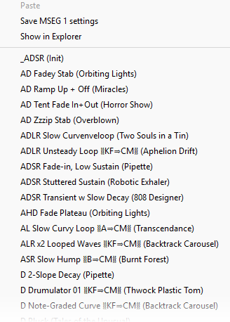

# p5c's Module Preset files for Zebra 3.0.0 Beta

Collection Version: **1.1.0**

## Overview

This is a collection of **358** .h2p **<ins>Module</ins>  Preset files** for the Zebra 3 beta's various generator/modulator/effect <ins>modules</ins>.


## What these are
I keep underlining  `<ins>module</ins>` here to make it clear that these are <ins>module</ins> presets and _not <ins>instrument</ins> presets_ (the Z3 beta already comes with 300 of those). <ins>Module</ins> presets work with Zebra 3's various generator/modulator/effect <ins>modules</ins>, which you can save/load/select from their panels' little downward-pointing arrow.

Or you _could_... except this first beta didn't come with any module presets (apart from two basic Oscillator WTs)! That's totally understandable for a monster synth that's still under heavy internal development, however testers in the beta thread mentioned missing them—so I dumped these as examples from the various instrument presets.

## Usage
After installing the presets, go to a module's panel and click the downward-facing arrow icon:


This brings up a pop-up window which should include that module's presets. Here's an example of what the top portion of the MSEG module's preset pop-up will look like:



You'll notice that there are naming conventions to describe each preset, which in the case of MSEGs includes their basic envelope characteristics (`ADLR`), a description I came up with (`Unsteady Loop`), an abbreviated summary of any baked-in (Z3 manual calls them `direct`) modulation assignments (`⧛KF⇒CM⧚`) and the original Zebra 3 beta preset the module was originally sourced from (`(Aphelion Drift)`), in parentheses. 

This `Name ⧛Mod⇒Target⧚ (Original Patch)` pattern is the basic naming convention, although (as seen with the MSEG envelope prefix) there might be slight differences tailored to the properties of individual modules. For instance, here's a breakdown of an Oscillator preset:

```
x3 Brite 1 ⧛LFO1⇒CM,Env2⇒FX1⧚ (Glow).h2p
┬─ ───┬──  ────────┬────────   ─┬──
│     │            │            │
│     │            │            ╰╴Name of Zebra 3.0.0 Beta patch
│     │            │              the module preset was derived from
│     │            │
│     │            ╰╴Preset-assigned Modulators:
│     │              - LFO1 controls Curve Morph
│     │              - Envelope 2 controls Oscillator FX1
│     │
│     ╰╴Preset Description
│
╰╴Preset contains 3 Waveforms
```

Hopefully the abbreviations make sense.  Some examples:

|       |                 |
| ----- | --------------- |
| `A`   | CtrlA           |
| `B`   | CtrlB           |
| `C`   | CtrlC           |
| `D`   | CtrlD           |
| `MW`  | Mod Wheel       |
| `KF`  | Key Follower    |
| `CM`  | Curve Morph     |
| `FX1` | Osciallator FX1 |
| `FX2` | Osciallator FX2 |

* You may also notice some lesser-known unicode characters. They are used to replace characters that are not valid for preset filenames. This is why you will se `⇒` instead of `=`, and `⧛`/`⧚` instead of square brackets.


## What's included

<!-- preset summary start -->
At present, this collection contains presets for  **26** Zebra 3 modules, with a grand total of **358** presets:

| Module          | Presets |
|-----------------|---------|
| MSEG            |      49 |
| Oscillator      |      45 |
| Mapper          |      33 |
| Envelope        |      25 |
| FMO             |      25 |
| FX Grid         |      20 |
| Noise           |      17 |
| Comb Filter     |      14 |
| Filter          |      14 |
| EQ              |      13 |
| Delay           |      12 |
| LFO             |      12 |
| Modal Resonator |      12 |
| ModFX           |       9 |
| TextureVerb     |       8 |
| ChannelMix 2in1 |       7 |
| Utility         |       6 |
| ChannelMix 4in1 |       5 |
| Distortion      |       5 |
| Exciter         |       5 |
| Wavefolder      |       5 |
| ChannelMix 4in4 |       4 |
| Compressor      |       4 |
| Ringmod         |       4 |
| Reverb          |       3 |
| 8-Tap           |       2 |

<!-- preset summary end -->

At least on my systems' various screen resolutions, I've found that 49 presets is a good maximum quantity for a single module, After that, you have to scroll the popup menu to get to additional items and it becomes increasingly cumbersome to browse.

It Zebra 3's module preset popup supported nested folders in module preset popups, this wouldn't a problem.  But for now (Z3 beta rev 20399), it doesn't.  If a later revision adds that capability, it will open doors to many more presets and _much_ better organization for many modules.

## What's missing
There currently remain **~~2~~** (**0?**) module directories without any .h2p presets:
- ~~CPUBurner~~\*
- ~~OscFX~~\*

\* = (Although `OscFx/` and `CPUBurner/` folders exist under `Zebra3.data/Modules/`, I haven't seen any indication that it's actrually possible to save/load presets for individual Oscillator FX or the CPU Burner.)


## Installation

Merge these module preset folders under `Zebra3.data/Modules/`

* MacOS: `MacHD/Library/Application Support/u-he/Zebra3/Modules/`
* Windows: `%USERPROFILE%\Documents\u-he\Zebra3.data\Modules\`
  * Example: `C:\Users\YOURUSERNAME\Documents\u-he\Zebra3.data\Modules\`
* Linux: `~/.u-he/Zebra3/Modules/`
  * Example: `/home/users/YOURUSERNAME/.u-he/Zebra3/Modules/`
  * Example (Ubuntu): `/home/YOURUSERNAME/.u-he/Zebra3/Modules/`


